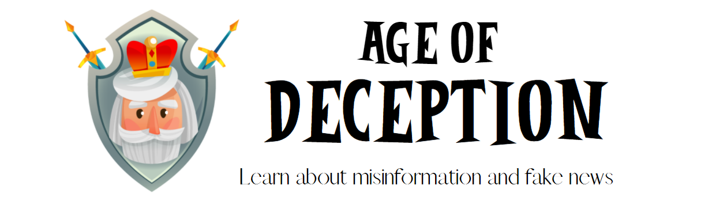
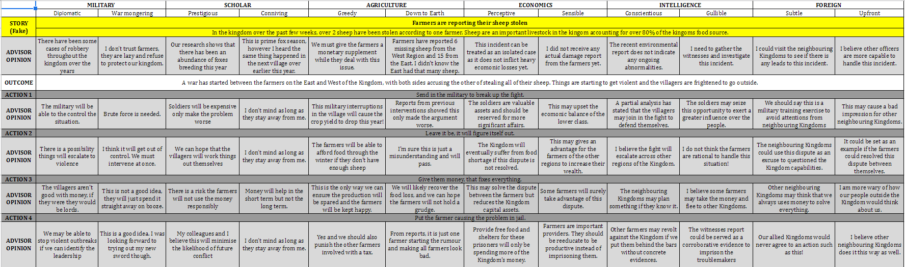
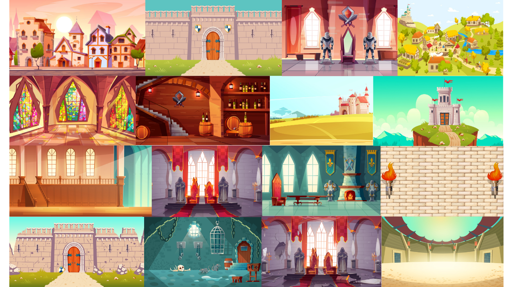
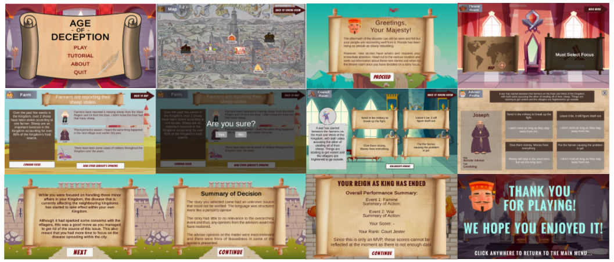
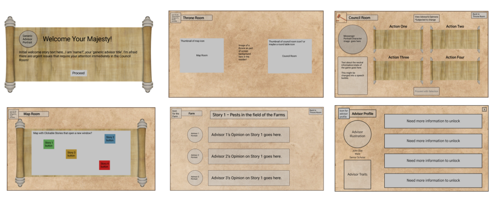
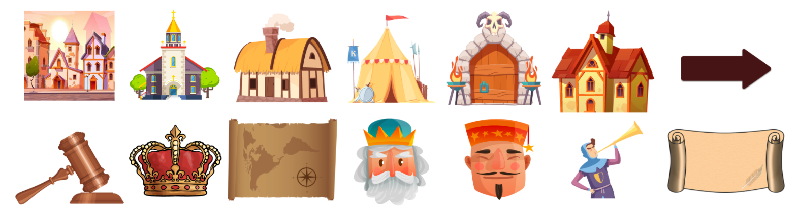
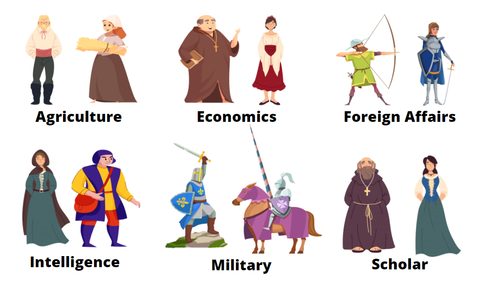

[FINAL](https://zebenman.github.io/DECO3801-Synergistics/Team-Portfolio/Final)  | [DEVELOPMENT](https://zebenman.github.io/DECO3801-Synergistics/Team-Portfolio/Development)     |     [MVP](https://zebenman.github.io/DECO3801-Synergistics/Team-Portfolio/MVP)

## ABOUT
'Age of Deception' aims to educate young people with critical thinking skills to deal with misinformation on social media via a game. The player is the King of an empire and based on information the game provides, they must make decisions which impact the entire kingdom. Sources of information are not always reliable and hence the player must develop a habit of researching and checking for reliable answers before reaching a decision.

## THE TEAM (SYNERGISTICS)

- Benedict Tan
- Ian Chern
- Tean-louise Cunningham
- Lachlan Frawley
- Kelvin Zhang
- Max Hornigold

## GETTING STARTED
The following software tools are required to build the solution.

- Visual Studio: This is required to edit and compile the various scripts used by unity to feed custom text into the game.

- Unity: All UI elements are contained and customised in unity. Prepare the project in Unity Hub using version **2019.4.10f1**. The project folder is `/Synergistics`.

Once all elements and scripts are ready the game can be built and launched from unity with provided `Build and Run` functionality.

# THE SOLUTION
The proposed solution is a 2D desktop game developed using C# and Unity. Stories are custom created by the team and stored in a template (`/Stories`). They are then converted  (using `EventBuilder/EventBuilder.sln`, and `Stories/UpdateStories.bat`) and stored (`/Synergistics/Resources`) as individual JSON files. These files are then imported and randomised (using `/Synergistics/Scripts`) into the game where appropriate for each scene. The scenes (`Synergistics/Assets/Scenes`) of the game have been designed with playful backgrounds (`Synergistics/Assets/Images`) and cartoonish characters (`Synergistics/Assets/UI Elements`) to create an interactive medieval world, free of real-world bias. The design is consistent (`Synergistics/Assets/Prefabs`) with clear guidance.

## STORIES
This folder contains a spreadsheet for each story in the game. These stories are based on real-time events, while immersing players in the medieval period.

- Each story has a title and text body.
- There are six advisor types, each with two opposing traits, all with opinions on the validity of the story.
- Each story is assigned a ‘factuality’ rating and has an outcome based on this rating.
- Connected to this outcome is four possible actions to deal with the consequences of the chosen story, and opinions of the actions by all advisors.

## EVENT BUILDER
The program `EventBuilder.sln` is responsible for constructing all the event details of the game by converting the stories from the `Stories` spreadsheet  to the relevant JSON files for rendering in the game.

The following process converts the `Stories` template to the relevant JSON files required for rendering in the game in `Synergistics/Resources`:
1. Make changes to the story in the spreadsheet.
2. Build `eventBuilder.sln`
2. Run `Stories/UpdateStories.bat`
4. All stories are successfully converted to JSON and can be found in `Synergistics/Resources`.

## SYNERGISTICS
This is the build folder used by unity to build and run the game.

### ASSETS

#### **Images**
All of the background images are stored here.

#### **Prefabs**
- Advisor Bio SSOC: For advisor bio pages in council room.
- AreYouSurePrefab: Prompt of 'Are you sure' when selecting buttons.
- GameController: The main menu.
- GSSCO: For story pages at locations in the map.

#### **Scenes**
There is a scene for each page in the game. The scenes use the relevant prefabs for consistency. The screens for the tutorial can also be found here.

#### **Screen Mockups**
This is the original basic design of each screen and was used as a base for the initial MVP.

#### **Scripts**
These scripts are the connection between the story text data and unity scenes. The relevant text is populated into the game, with randomisation of advisor opinions.

#### **UI Elements**
All icons used in the game are stored as well

As well as the images for the advisors.

### RESOURCES
This is where all the text data used by the game is stored. This includes the random names of the advisors and the story event information.

#### **Events**
The event text data is stored here after being converted from the `Stories` template to the relevant JSON files using `EventBuilder.sln` and `UpdateStories.bat` script.

- Each story is stored in an individual JSON.e.g. `MissingSheep.txt`:
- Each story is assigned a folder with all of the relevant advisor opinions and actions. e.g. `MissingSheep_data`:
- File for each story outcome e.g. `SOP_Solution0`
- Story opinion of each advisor e.g. `PFP_AGRICULTUREDown to Earth`
- Outcome opinion of an advisor e.g. `POF_AGRICULTUREDown to Earth`
