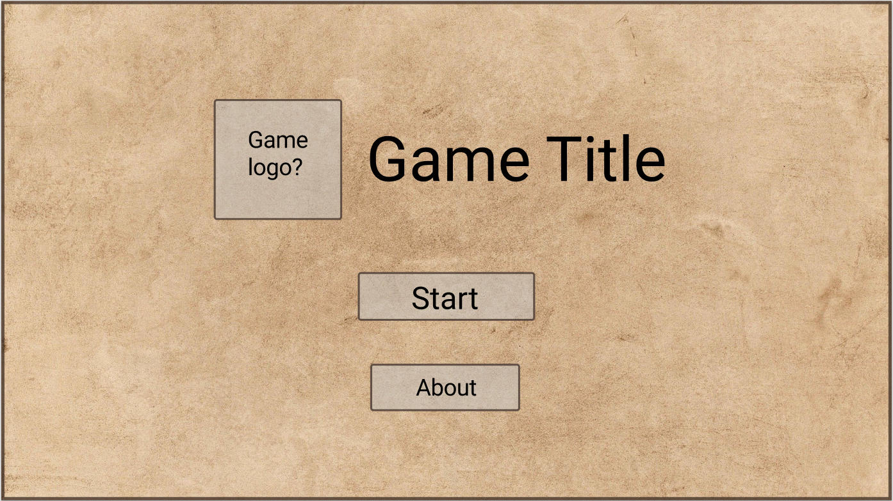
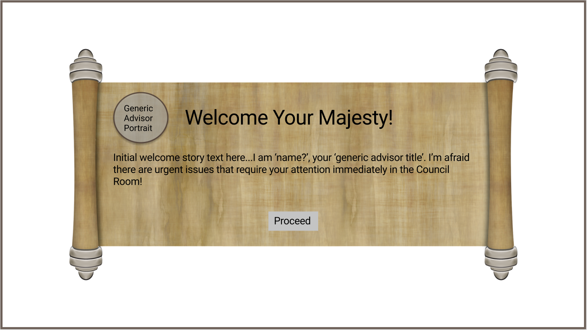
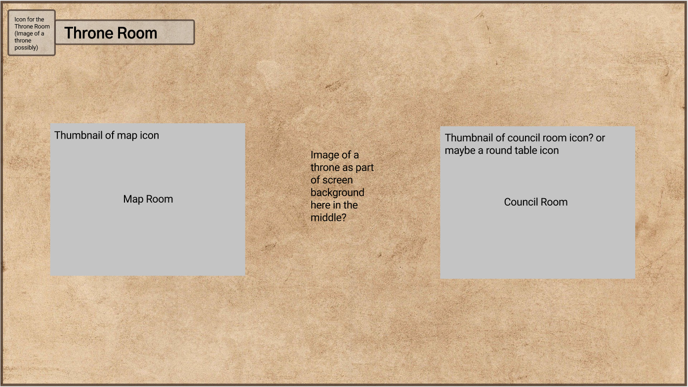
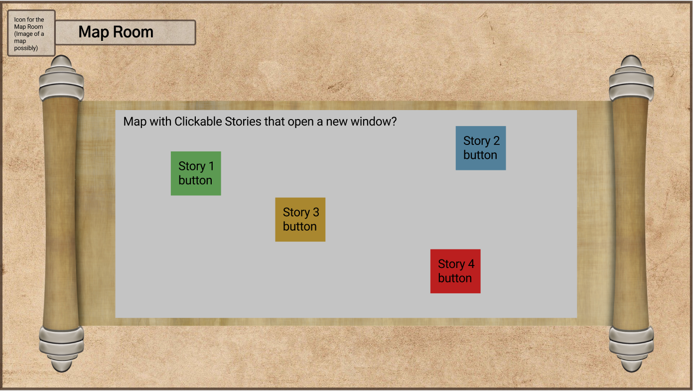
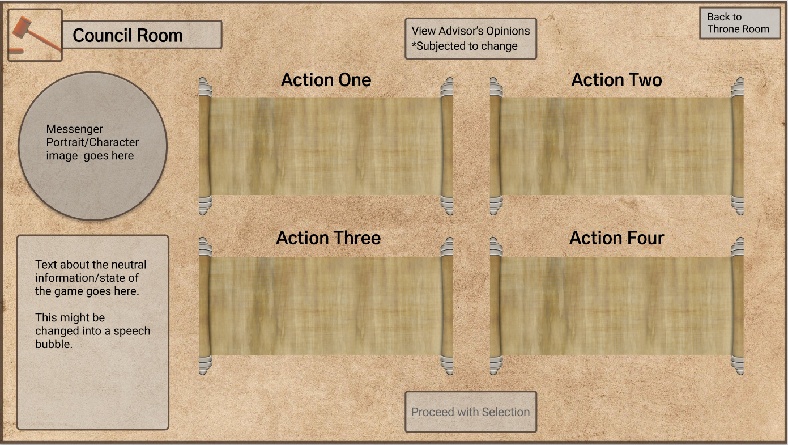
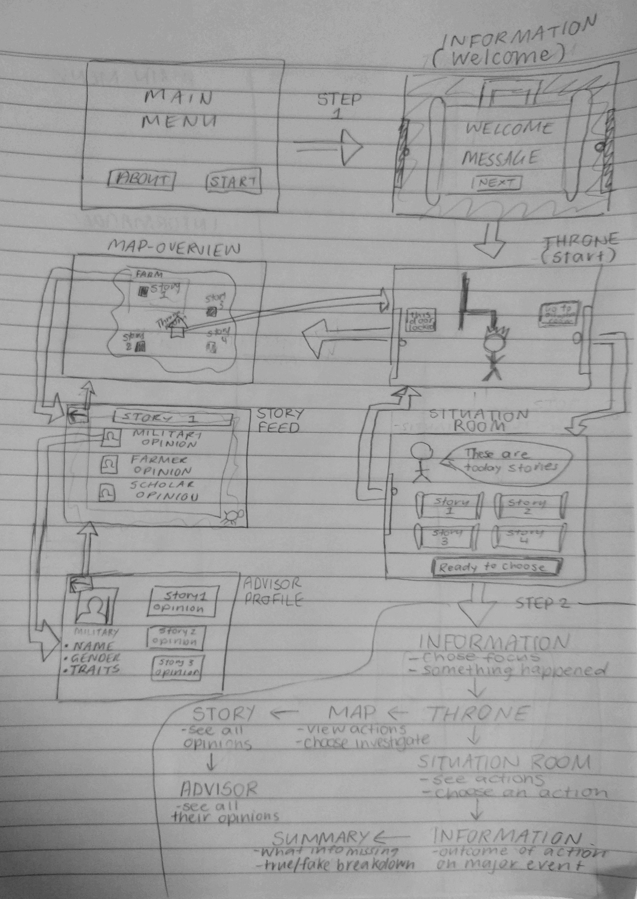

[FINAL](https://zebenman.github.io/DECO3801-Synergistics/Team-Portfolio/Final)  | DEVELOPMENT  |  [MVP](https://zebenman.github.io/DECO3801-Synergistics/Team-Portfolio/MVP)

# STATEMENT OF WORK
Find below a brief outline of the proposal Synergistics will work on, as well as the features from the specification that we intend to build and the tools we intend to complete this with.

[**READ MORE**](https://zebenman.github.io/DECO3801-Synergistics/Team-Portfolio/Development/Statement-of-Work)

# DESIGN DOCUMENTATION
- Link to view the report.

# USER TESTING

- Link to view the report
- [Google Form](https://forms.gle/9JHe7Gtn9e9Fef477)

# INITIAL WIREFRAMES

# PAPER PROTOTYPE

