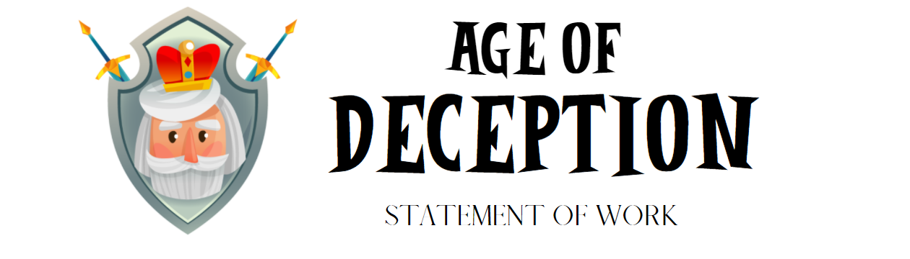

[FINAL](https://zebenman.github.io/DECO3801-Synergistics/Team_Portfolio/Final)  | [DEVELOPMENT](https://zebenman.github.io/DECO3801-Synergistics/Team_Portfolio/Development)     |     [MVP](https://zebenman.github.io/DECO3801-Synergistics/Team_Portfolio/MVP)

# Team Details
Below are our team details, including our team name, leader, members, and individual skills.

## Team Name
Synergistics

## Team Membership & Skills

Benedict Tan (Team Leader) (45354209)
- Comfortable with UI/UX design
- Good with HTML/CSS, not as much JS
- Report/documentation and presenting 
- Some experience with Java

Ian Chern (45632475)
- Basic HTML, CSS, JS and PHP
- Web design using MVC PHP framework with MYSQLi
- Academic writings and presentations

Tean-louise Cunningham (42637460)
- Writing reports and presenting
- UX/UI design
- Cloud integration
- Coding - most experienced in python

Lachlan Frawley (45318238)
- Strong programmer with lots of experience in C#/C++/C
- Mobile app development

Kelvin Zhang (45377244)
- UI/UX design/concept/planning
- General experience with Python/Java/C
- Good writing/formatting/presenting

Max Hornigold (45314641) 
- Experience with Java, Python, C, HTML, CSS.
- Basic UI/UX design.
- Good writing, formatting and presenting skills

# Proposal
Find below a brief outline of the proposal Synergistics will work on, as well as the features from the specification that we intend to build and the tools we intend to complete this with.

## Proposal Outline
Synergistics will be working on the proposal ‘Misinformation and Fake News’ presented by Team Grape. Their proposal aims to educate young people how to identify, analyse and filter out cases of misinformation and fake news on social-media through the means of a game.

The player is in control of an empire and based on the information the game provides, they must decide if it is ‘real’ or ‘fake’. The player’s decisions will have a significant impact on the state of the empire. Hence, users must develop a habit of researching and checking for reliable answers before reaching a decision.

## Proposal Features
There are two core features from the specification that the team intends to build. Firstly, the team intends to keep the original game theme and setting, during the era of kingdoms and empires. This would ideally be during the medieval period to eliminate potential bias. The gamification element is specifically suited towards the target demographic of young adults.

Secondly, the team intends to maintain the core focus of the game being to make informed decisions and filter out misinformation or fake news. These decisions will have a meaningful impact on the story and teach players about the consequences of their actions. The idea is to have the news and information provided in the game mirror news and information provided in social media. This supports the provided research that education is more effective than pre/post debunking methods.

The general flow follows the specification where the player will be neutrally presented with numerous news stories. The player can speak with several advisors who will each have opinions and will be tasked with focusing on only those stories they believe are true. Their choices will impact the severity of a major event that will impact their kingdom. Additionally, when an event occurs, the user will be provided a summary of what information they were missing and which news stories were true/false. This loop will repeat for each major event. In some cases the user may be aware of what the next event will be and for others they will have no preceding information. The ‘difficulty’ of choosing true stories will progress with each event.

Gameplay will be short with minimal events and clear guidance. We intend to immerse players through the use of these interactions, interesting stories, engaging characters and aesthetics to compliment the gameplay. These features will give players the sense that they are genuinely in full control of their kingdom and that the decisions they make heavily affect the state of their kingdom. The aim is that this experience reflects the same way that their judgement and decisions that are made in real life has an effect on their environment.

The interaction paradigm will be desktop only as this will provide the optimal gaming experience. The game will be 2D given team strengths/timeframe. The core game engine and game logic will be built with the C# programming language. We intend to make use of the platform Unity3d as the main software to do all the features on. We will be using Paint.net and/or Adobe Photoshop to generate the art/aesthetics assets if need be. Designing of the UI will be done using Figma or Adobe XD.

# Project Plan
Find below the project plan, which includes the project timeline, project milestones, team personnel resource allocation, as well as potential risks and risk mitigation.

## Project Timeline
14 Aug - 03 Sep:
Completion of Minimum Viable Product (MVP): Core features and aesthetics
- UI Mockup & Game Flow - 19 Aug
- Game Content (Stories/Characters) - 23 Aug
- Game Screens (Added to Unity) - 26 Aug
- Completion of 1 major event sequence (Game Logic) - 3 Sep

04 Sep: Preparation for Mid-Project Presentation

07 Sep 10:00: Mid-Project and MVP Presentation

07 Sep - 18 Sep: Apply changes to Design from feedback on MVP and User Testing
- Changes made to MVP from the feedback - 11 Sep
- User Testing (5 - 10 Users) - 18 Sep

19 Sep - 18 Oct: Completion of additional programming features and refining key aesthetics
- Feedback from User Testing
- Refined Aesthetics
- Additional major event sequences (Game Logic)
- Extra essential Game Screens
- Debugging and Game Logic refinement

18 Oct: Project build complete

22 Oct: Team reflection piece and quick start guide complete; Kickstarter video uploaded

23 Oct: Final checklist of all required items

24 Oct: Preparation for Final Product Demonstration (Presentation rehearsal)

26 Oct 10:00: Final Product Demonstration and Portfolio

## Project Milestones
Minimum Viable Product
- Functioning UI
- Core gameplay features
- Basic aesthetics
Final Delivery
- Software demo (best features/aspects of the software)
- Reflection of the brief and how we've met it with our application
Creative Team Portfolio
- Team reflection piece
- Kickstarter style promotion video
- Interactive presentation

Completed project build (ready to deliver to stakeholders/release to market)
- Project builds
- Source code
- Project assets
- Quick start guide

## Resource Allocation
- Lachlan Frawley - Programmer
- Max Hornigold - Programmer
- Kelvin Zhang - Designer
- Tean-louise Cunningham - Designer
- Ian Chern - Designer
- Benedict Tan - Designer/Programmer

_**Designer**: Design story, game visuals, UX/UI, aesthetics_

_**Programmer**: Implementation of game logic and GUI_

## Potential Risks & Mitigation

| Risk            | Mitigation                             |
| :------------------:|:---------------------------------:|
| The team may not have enough team members comfortable with the technologies required to build the product.       |Ensure members are assigned to their technical strengths and communicate what each member may be required to learn in advance.            |
| Unforeseen difficulties may lead to delays, potentially causing timeline adjustments and certain deliverables to not be completed on time.  | Issues should be identified early to allow for the greatest amount of time for the team to respond and address it. |
| Project features will include dependencies on each other's work. |Clear team communication and time management between dependent tasks.  |
| Underestimating the difficulty and time requirement of tasks. | Clear project plan and timeline with generous margins for time to complete tasks. |

# Team Collaboration Plan
Find below Synergistic’s team collaboration plan, which specifies the tools we will use to communicate with one another and when exactly we will meet and discuss our progress.

## Tools & Software
- Discord - Group server for continuous text/voice communication and - discussion.
- Google Drive/Docs - Shared folder to access common documents and to allow simultaneous collaboration on writing reports/documents.
- Github - Version control to keep track of code changes and allow shared access to the most up-to-date code.
- Trello - For overall project management and progress checking.
- Miro - For brainstorming, concept mapping, and storyboarding.

## Meeting/Communication
The first studio session of each week will be conducted on Mondays at 10:00am - 12:00pm. This meeting will be located at UQ for flexible delivery students and over Discord for external students. This meeting will be used to decide the deliverables for that week and any other matters.

The second studio session of each week will be conducted on Fridays at 4:00pm - 6:00pm. This meeting will be held over Discord for all students. This meeting is a check-up on the progress of each team member and to iron out any additional issues and amendments to make over the weekend.

In between these two studio sessions, team members can contact each other on Discord to conduct any impromptu meetings and/or discussions.
