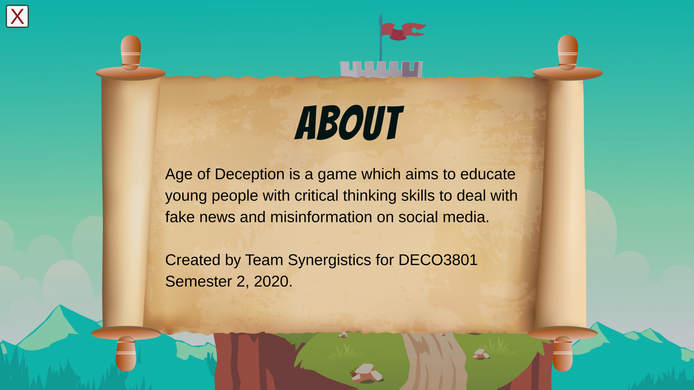
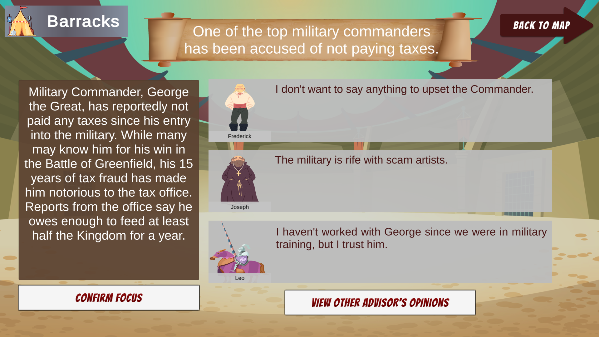

FINAL  | [DEVELOPMENT](https://zebenman.github.io/DECO3801-Synergistics/Team-Portfolio/Development)     |     [MVP](https://zebenman.github.io/DECO3801-Synergistics/Team-Portfolio/MVP)

# PORTFOLIO VIDEO

# SLIDES

# GAME DEMO

# HOW-TO-GUIDE
Learn how to play the game by following this walkthrough.

**[READ MORE](https://zebenman.github.io/DECO3801-Synergistics/Team-Portfolio/Final/Tutorial/Guide)**

# IMAGES

